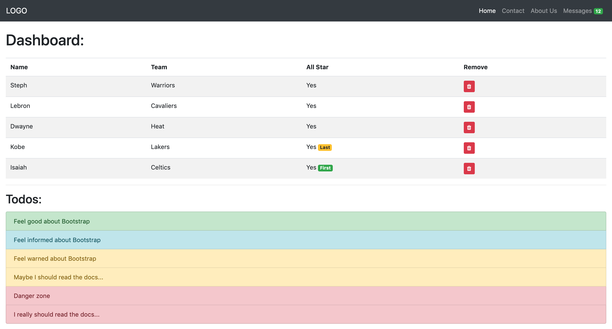

# Bootstrap Mocks

For this assignment you should only use Twitter Bootstrap, Font Awesome, and Lorem Pixel for placeholder images.

**Do not write any custom CSS.**

## Step One
Write the necessary code to make your page look just like this one:

## Step Two
Write the necessary HTML to make your page look just like this one:

## Further Study
Have extra time? Play with some of the JavaScript-based interactive components, like:

- modal dialogs
- popups
- dropdown menus
